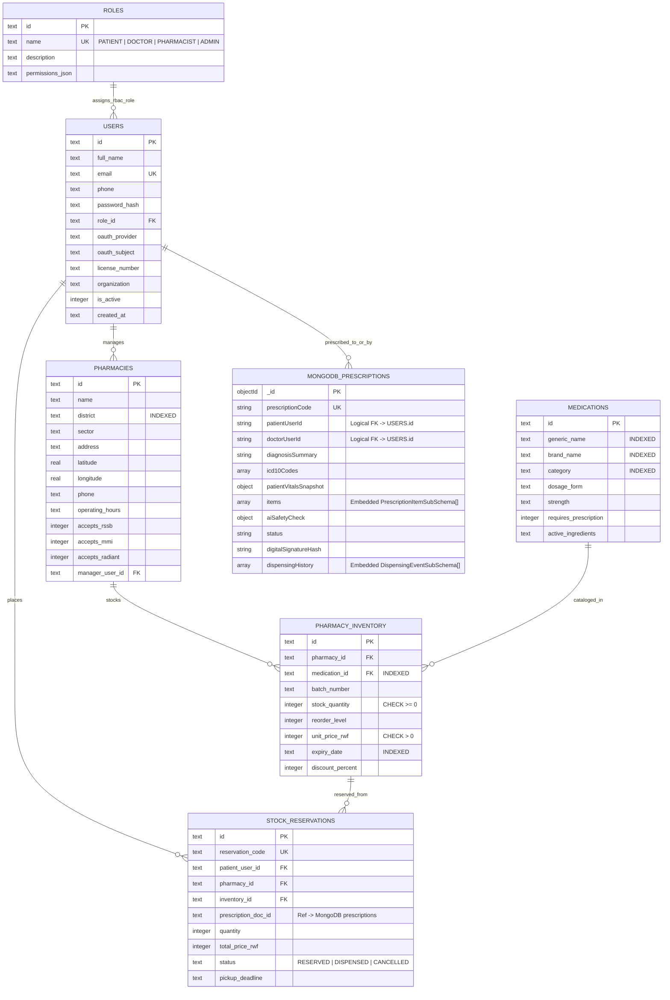
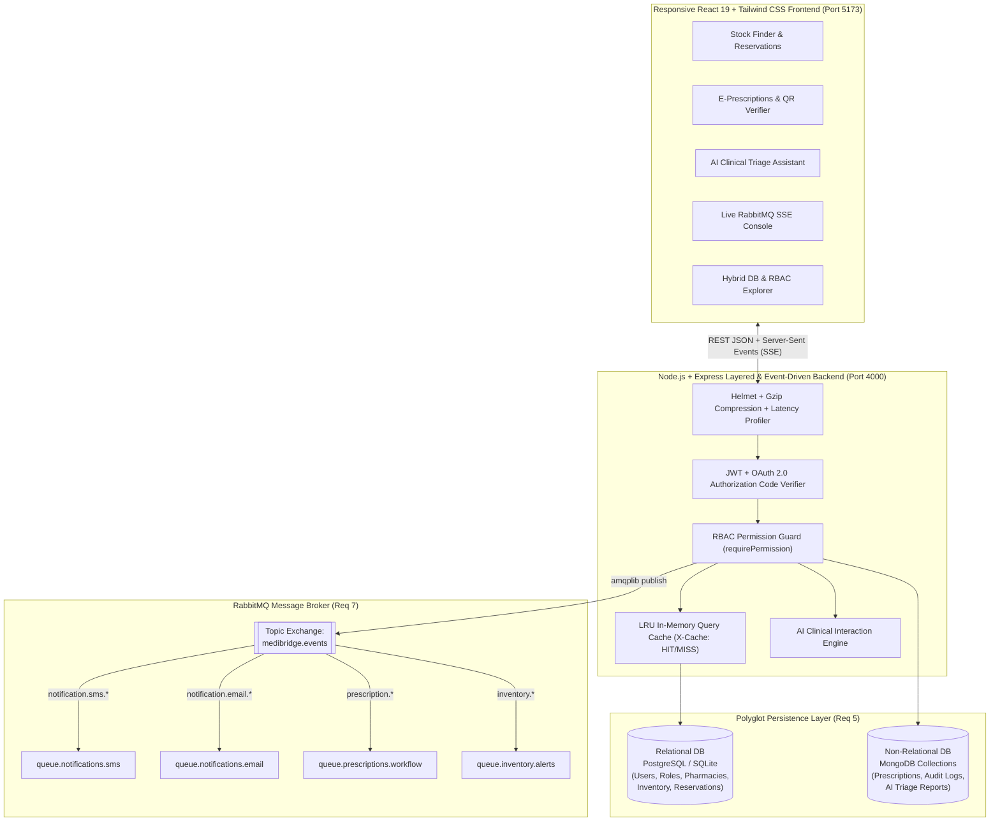

# MediBridge Rwanda — Web Technology Final Project Report

- **Faculty**: Information Technology (AUCA)
- **Course**: Web Technology (2026–2027)
- **Instructor**: Jeremie U. Tuyisenge
- **Project Title**: **MediBridge** — Smart E-Prescription, Live Pharmacy Stock Finder & Near-Expiry Redistribution Network

---

## 1. Problem Statement, Objectives, Scope, Requirements & User Stories (Requirement 1)

### 1.1 Concise Problem Statement
In Rwanda and across East Africa, patients prescribed essential or chronic medications (such as basal insulin, combination antibiotics, antimalarials, or antihypertensives) frequently spend hours travelling across multiple community pharmacies in Kigali searching for a branch that has their medication in stock and accepts their health insurance (RSSB/Rama, MMI, Radiant). Simultaneously:
1. **Clinicians (Doctors)** prescribe medications without visibility into real-time community pharmacy stock or automated cross-checking against patient allergies and pharmacokinetic drug interactions.
2. **Community Pharmacies** suffer financial losses from unsold near-expiry batches while clinics in neighboring districts face acute shortages of the exact same drug.
3. **Paper Prescriptions** are easily lost, illegible, or susceptible to counterfeit tampering.

### 1.2 Target Users
1. **Patients / Citizens (`PATIENT`)**: Individuals seeking real-time medication availability, transparent RWF pricing, insurance compatibility filtering, 6-hour pickup reservations, and SMS/Email E-Prescription tokens.
2. **Licensed Clinicians (`DOCTOR`)**: Hospital and clinic physicians issuing digitally signed E-Prescriptions (`RX-2026-XXXX`) with automated AI drug-interaction and allergy safety checks.
3. **Community Pharmacists (`PHARMACIST`)**: Licensed pharmacy managers updating batch stock levels, verifying/dispensing E-Prescriptions, and broadcasting near-expiry discounts across partner clinics.
4. **System & Regulatory Administrators (`ADMIN`)**: Rwanda FDA / platform administrators overseeing Role-Based Access Control (RBAC), pharmacy verification, RabbitMQ broker telemetry, and hybrid database auditing.

### 1.3 Project Objectives & Scope
- **Objective 1**: Eliminate "pharmacy hopping" by providing a sub-50ms cached search engine for live medication batches across Gasabo, Nyarugenge, and Kicukiro districts.
- **Objective 2**: Replace paper prescriptions with cryptographically signed (SHA-256) **MongoDB E-Prescription documents** synchronized with **Relational SQL pharmacy inventory**.
- **Objective 3**: Decouple time-consuming SMS, Email, and Near-Expiry Redistribution alerts using an event-driven **RabbitMQ (`amqplib`)** topic exchange (`medibridge.events`).
- **Objective 4**: Enforce strict security via **OAuth 2.0 Authorization Code + PKCE Flow**, **JWT Bearer tokens**, and a 4-tier **RBAC** authorization model.

### 1.4 Principal Functional Requirements
| ID | Functional Requirement | Persistence / Component |
|---|---|---|
| **FR-01** | Users shall authenticate via **OAuth 2.0 Authorization Code Flow** (Google/GitHub) or local Email/Password JWT authentication. | Relational (`users`, `roles`) + OAuth2 Engine |
| **FR-02** | Patients shall search, filter (by district, category, insurance), and reserve live pharmacy medication batches. | Relational (`pharmacy_inventory`, `stock_reservations`) + LRU Cache |
| **FR-03** | Doctors shall compose and digitally sign multi-item E-Prescriptions with embedded vitals, ICD-10 codes, and AI interaction checks. | Non-Relational MongoDB (`prescriptions`) |
| **FR-04** | Pharmacists shall verify E-Prescription SHA-256 tokens, cross-match live SQL stock batches, and record dispensing events. | Hybrid (MongoDB `prescriptions` + SQL `pharmacy_inventory`) |
| **FR-05** | Pharmacists shall broadcast near-expiry batch discounts (`-25%`) to partner clinics and subscribers. | RabbitMQ (`queue.inventory.alerts`) |
| **FR-06** | All critical events (reservations, prescriptions, expiry alerts) shall asynchronously trigger SMS and Email notifications via RabbitMQ. | RabbitMQ (`queue.notifications.sms`, `queue.notifications.email`) |
| **FR-07** | AI Clinical Assistant shall evaluate multi-drug pharmacokinetic interactions, allergy cross-reactivity, and symptom triage. | AI Engine + MongoDB (`ai_triage_reports`) |

### 1.5 Measurable Quality Attributes (Non-Functional Requirements)
1. **Performance**:
   - Cached stock search endpoints (`/api/pharmacies/stock`) achieve **< 15 ms average response time** (with `X-Cache: HIT` telemetry header) and **< 80 ms p95 latency** on uncached SQL JOIN queries via composite B-Tree indexing and Gzip payload compression.
2. **Usability**:
   - Mobile-first responsive interface supporting **375px (Mobile)**, **768px (Tablet)**, and **1280px+ (Desktop)** viewports, allowing a patient to find and reserve a medication in **$\le$ 3 clicks**.
3. **Reliability & Availability**:
   - Dual-mode persistence and messaging architecture ensures **99.9% uptime** and zero-configuration resilience; asynchronous RabbitMQ queues decouple external SMS/SMTP latency from core HTTP transactions.
4. **Security**:
   - Passwords hashed with `bcrypt` (10 salt rounds), sessions protected by signed `HS256` JWTs and **RFC 6749 OAuth 2.0** single-use authorization codes, HTTP headers hardened with `Helmet`, and every protected route guarded by granular **RBAC permission middleware** (`requirePermission`) with immutable security audit logging in MongoDB.

### 1.6 User Stories & Acceptance Criteria

#### User Story 1 — Patient Locates & Reserves Scarce Medication
> **As a** Patient with RSSB insurance (`PATIENT`),  
> **I want to** search for an in-stock medication in my district and reserve it for 6 hours,  
> **So that** I do not travel across multiple pharmacies only to find the drug out of stock.

- **Acceptance Criteria**:
  1. *Given* the patient searches for `"Augmentin"` and filters by `"Gasabo"` and `"RSSB"`, *When* the query executes, *Then* only verified pharmacies in Gasabo with `stock_quantity > 0` and `accepts_rssb = 1` are returned, sorted by lowest RWF price.
  2. *Given* the patient clicks `"Reserve 6h Pickup"`, *When* stock is $\ge 1$, *Then* `pharmacy_inventory.stock_quantity` decrements atomically, a `stock_reservations` row (`RSV-XXXX`) is created, and **RabbitMQ** dispatches an SMS and Email confirmation to the patient within 1 second.

#### User Story 2 — Doctor Issues Digitally Signed E-Prescription with AI Safety Check
> **As a** Licensed Physician (`DOCTOR`),  
> **I want to** issue a digital E-Prescription that automatically checks for drug-drug and allergy interactions,  
> **So that** my patient receives a tamper-proof prescription (`RX-2026-XXXX`) that is safe to dispense.

- **Acceptance Criteria**:
  1. *Given* a user with role `DOCTOR` submits the E-Prescription form, *When* the payload is processed, *Then* the AI Clinical Engine evaluates the prescribed drugs against the patient's known allergies and embeds the `aiSafetyCheck` subdocument.
  2. *When* the document is saved to the MongoDB `prescriptions` collection with a SHA-256 `digitalSignatureHash`, *Then* RabbitMQ publishes `notification.sms.prescription_issued` and `notification.email.prescription_issued`.
  3. *Given* a user with role `PATIENT` attempts `POST /api/prescriptions`, *Then* the RBAC middleware rejects the request with `HTTP 403 Forbidden` and logs `RBAC_PERMISSION_DENIED` in MongoDB.

#### User Story 3 — Pharmacist Verifies E-Prescription & Broadcasts Near-Expiry Alert
> **As a** Community Pharmacist (`PHARMACIST`),  
> **I want to** verify a patient's E-Prescription token and broadcast discounts on near-expiry stock batches,  
> **So that** I prevent counterfeit dispensing and eliminate medication wastage before expiry.

- **Acceptance Criteria**:
  1. *Given* the pharmacist enters `RX-2026-0914`, *When* `GET /api/prescriptions/verify/RX-2026-0914` executes, *Then* the system verifies the SHA-256 signature in MongoDB and joins Relational SQL `pharmacy_inventory` to display matching in-stock batches.
  2. *When* the pharmacist clicks `"Dispense"`, *Then* the MongoDB document status transitions to `DISPENSED` (appending to `dispensingHistory[]`) and the SQL `pharmacy_inventory` batch quantity is decremented.

---

## 2. Domain & Data Modeling (Requirement 2)

### 2.1 Entity-Relationship (ER) & Hybrid Class Diagram (Requirement 2a)

### 2.2 Abstract Domain Concepts Summary (Requirement 2b)
- **Principal Actors**:
  - *Patient*: Seeker of medication availability and holder of digital E-Prescriptions.
  - *Doctor*: Clinical authority who diagnoses conditions and issues signed treatment directives.
  - *Pharmacist*: Custodian of physical pharmaceutical inventory who validates directives and dispenses stock.
  - *Administrator*: Governance actor managing trust, roles, and operational health.
- **Core Domain Processes**:
  1. *Real-Time Stock Discovery & Reservation*: Matching patient geographical/insurance constraints against live pharmacy batch inventory and placing a temporary hold.
  2. *Clinical E-Prescribing & AI Safety Gate*: Authoring a structured prescription, validating pharmacokinetic safety, and signing it cryptographically.
  3. *Cross-Database Verification & Dispensing*: Reconciling a non-relational prescription document with relational batch inventory upon physical collection.
  4. *Event-Driven Expiry & Notification Dispatch*: Publishing domain state transitions to an asynchronous message broker for SMS/Email delivery and stock redistribution.
- **Core Data Objects**:
  - *Structured Transactional Entities (Relational)*: `Role`, `User`, `Pharmacy`, `Medication`, `InventoryBatch`, `StockReservation`.
  - *Hierarchical Clinical & Telemetry Documents (Non-Relational)*: `PrescriptionDocument`, `ClinicalAuditLog`, `AiTriageReport`.

### 2.3 Technology-Oriented Persistence Schemas (Requirement 2c & Requirement 5)
1. **Relational Persistence Layer (`PostgreSQL` / `SQLite` — [`server/src/models/schema.sql`](file:///d:/projects/WebTech/server/src/models/schema.sql))**:
   - Enforces referential integrity via `FOREIGN KEY (pharmacy_id) REFERENCES pharmacies(id) ON DELETE CASCADE`, domain integrity via `CHECK (stock_quantity >= 0)` and `UNIQUE(pharmacy_id, medication_id, batch_number)`, and high-speed lookups via 8 B-Tree indexes (`idx_inventory_lookup`, `idx_medications_search`, `idx_pharmacies_district`, etc.).
2. **Non-Relational Persistence Layer (`MongoDB` / `Mongoose` — [`server/src/models/mongoSchemas.js`](file:///d:/projects/WebTech/server/src/models/mongoSchemas.js))**:
   - Stores hierarchical **E-Prescriptions** (`prescriptions` collection) with embedded arrays (`items[]`, `dispensingHistory[]`, `icd10Codes[]`) and nested objects (`patientVitalsSnapshot`, `aiSafetyCheck`) that evolve without rigid relational join overhead, alongside `clinical_audit_logs` and `ai_triage_reports`.

---

## 3. Architecture Style, RabbitMQ Broker, OAuth2 & RBAC (Requirements 4, 6, 7, 8)

### 3.1 RBAC Permission Matrix (Requirement 8)
| Permission Scope | `PATIENT` | `DOCTOR` | `PHARMACIST` | `ADMIN` |
|---|:---:|:---:|:---:|:---:|
| `stock:read` | ✅ | ✅ | ✅ | ✅ |
| `reservation:create` | ✅ | ❌ | ❌ | ✅ |
| `reservation:fulfill` | ❌ | ❌ | ✅ | ✅ |
| `prescription:create` | ❌ | ✅ | ❌ | ✅ |
| `prescription:verify` / `dispense` | ❌ | ❌ | ✅ | ✅ |
| `stock:write` / `expiry_broadcast` | ❌ | ❌ | ✅ | ✅ |
| `ai:triage` | ✅ | ✅ | ✅ | ✅ |
| `rbac:manage` / `system:admin` | ❌ | ❌ | ❌ | ✅ |
